# FluidVoice — Complete Code Flow

> A ground-up, in-depth walkthrough of how FluidVoice turns a keypress into typed text.
> Every file, every function, every concept — explained as if you've never seen Rust before.

---

## Table of Contents

1. [What even is FluidVoice?](#1-what-even-is-fluidvoice)
2. [The 7 Files — What each one does](#2-the-7-files--what-each-one-does)
3. [Phase 1 — The Application Boots Up](#3-phase-1--the-application-boots-up)
4. [Phase 2 — Waiting for the Hotkey](#4-phase-2--waiting-for-the-hotkey)
5. [Phase 3 — Recording Your Voice](#5-phase-3--recording-your-voice)
6. [Phase 4 — Cleaning the Audio](#6-phase-4--cleaning-the-audio)
7. [Phase 5 — Transcription (Speech → Text)](#7-phase-5--transcription-speech--text)
8. [Phase 6 — Typing the Text Into Your App](#8-phase-6--typing-the-text-into-your-app)
9. [Phase 7 — Bookkeeping & Feedback](#9-phase-7--bookkeeping--feedback)
10. [Full Journey — One Diagram](#10-full-journey--one-diagram)

---

## 1. What even is FluidVoice?

FluidVoice is a **background Windows application**. You press a keyboard shortcut, speak into your microphone for 5 seconds, and the app automatically **types what you said** into whatever window is currently active — your browser, Notepad, Slack, anything.

It has two "brains":
- **Local Mode**: Uses an AI model file stored on your computer (runs offline, private).
- **Cloud Mode**: Sends your audio to OpenAI's servers and gets the text back (requires internet + API key).

The app is written in **Rust**, compiled into a single `.exe` file, and lives in your system tray.

---

## 2. The 7 Files — What each one does

Before diving into the flow, here's a map of the entire codebase. The application has only **7 source files**, and every single one has a clear, focused job.

```mermaid
graph LR
    subgraph "📁 MVP/src/"
        main["main.rs<br/><i>The conductor — runs everything</i>"]
        config["config.rs<br/><i>Reads your settings file</i>"]
        model["model.rs<br/><i>Downloads the AI brain</i>"]
        transcriber["transcriber.rs<br/><i>Runs the AI locally</i>"]
        audio["audio_feedback.rs<br/><i>Plays beep sounds</i>"]
        tray["tray.rs<br/><i>Creates the system tray icon</i>"]
        telemetry["telemetry.rs<br/><i>Tracks usage stats</i>"]
    end

    main --> config
    main --> model
    main --> transcriber
    main --> audio
    main --> tray
    main --> telemetry
```



| File | Lines | Purpose |
|:---|:---:|:---|
| `main.rs` | 315 | The central orchestrator. Contains the main loop, hotkey listener, audio recording, resampling, text typing, and the OpenAI API call. |
| `config.rs` | 38 | Reads `config.toml` to get user settings (hotkey, recording duration, API key). Creates a default config file if none exists. |
| `model.rs` | 55 | Checks if the Whisper AI model file exists on disk. If not, downloads it (~142 MB) from HuggingFace. Only used in Local mode. |
| `transcriber.rs` | 55 | Loads the Whisper model into memory and runs inference (audio → text). Only used in Local mode. |
| `audio_feedback.rs` | 44 | Generates simple sine-wave beep sounds (start beep, stop beep, error beep) so the user knows what's happening. |
| `tray.rs` | 28 | Creates a Windows system tray icon with a "Quit" menu item. |
| `telemetry.rs` | 55 | Saves usage statistics to `stats.json` (how many recordings, total seconds, errors). |

---

## 3. Phase 1 — The Application Boots Up

When you double-click `fluidvoice-mvp.exe`, Rust calls the `main()` function in `main.rs`. The first thing the app does is **set itself up**. Let's walk through each setup step.

### Step 1.1: "Am I the only one running?"

```
📍 main.rs → line 29
```

```rust
let instance = SingleInstance::new("fluidvoice_mvp_instance").unwrap();
if !instance.is_single() {
    eprintln!("FluidVoice is already running.");
    return Ok(());
}
```

**Why?** Imagine accidentally opening the app twice. Both copies would listen for the same hotkey, both would record audio, and both would try to type text — absolute chaos. The `SingleInstance` check creates a system-wide named lock. If another copy is already running, this one prints a message and immediately exits.


### Step 1.2: Load user settings

```
📍 main.rs → line 36 → calls config.rs
```

```rust
let config = config::load_config().unwrap_or_default();
```

This calls the `load_config()` function in `config.rs`. Here's the logic inside it:

1. Look for a file called `config.toml` in the current directory.
2. **If it doesn't exist** → Create one with default values and return those defaults.
3. **If it does exist** → Read it, parse the TOML format, and return the settings.

The settings it reads:

| Setting | Default | What it controls |
|:---|:---|:---|
| `hotkey` | `"Ctrl+Shift+V"` | The keyboard shortcut to activate recording |
| `record_duration_ms` | `5000` | How long to record (in milliseconds, so 5 seconds) |
| `audio_device_index` | `None` | Which microphone to use (None = system default) |
| `openai_api_key` | `None` | Your API key for OpenAI (only needed in Cloud mode) |

> [!NOTE]
> The `unwrap_or_default()` at the end is a safety net. If `load_config()` fails for any reason (file corrupted, permission error, etc.), the app just uses built-in defaults instead of crashing.

### Step 1.3: Load usage statistics

```
📍 main.rs → line 37 → calls telemetry.rs
```

```rust
telemetry::load_stats();
```

This reads a file called `stats.json` (if it exists) and loads previous usage data into a global variable called `STATS`. This is a `Mutex<UsageStats>` — a thread-safe container that tracks:
- How many recordings you've made
- Total seconds of audio recorded
- How many errors occurred
- When you last used the app

### Step 1.4: Prepare the AI engine

```
📍 main.rs → lines 40–48
```

This is where the two modes diverge for the first time.

**Local Mode** (the `#[cfg(feature = "local")]` blocks):
1. Calls `model::ensure_model_exists()` in `model.rs`.
   - Looks for `ggml-base.en.bin` (the Whisper AI model file, ~142 MB) next to the `.exe`.
   - **If found** → Continues.
   - **If not found** → Downloads it from HuggingFace (one-time download, takes a few minutes).
2. Creates a `LocalTranscriber` in `transcriber.rs`:
   - Loads the model file into memory using `whisper-rs`.
   - This is the most expensive startup step — it allocates memory for the neural network.
   - The transcriber is wrapped in `Arc` (Atomic Reference Counter) so it can be safely shared across the program.

**Cloud Mode** (the `#[cfg(feature = "openai")]` blocks):
- Just prints a message. No model to load — the heavy lifting will happen on OpenAI's servers later.

```mermaid
flowchart TD
    A["Phase 1: Boot Up"] --> B["1.1 Single Instance Check"]
    B --> C["1.2 Load config.toml"]
    C --> D["1.3 Load stats.json"]
    D --> E{"Which mode?"}

    E -->|"Local"| F["1.4a Download model<br/>(if first run)"]
    F --> G["1.4b Load model into RAM"]

    E -->|"Cloud/OpenAI"| H["1.4c Just print a message"]

    G --> I["1.5 Create System Tray"]
    H --> I

    I --> J["1.6 Create Audio Feedback"]
    J --> K["Ready! ✅"]

    style B fill:#4C6EF5,color:#fff
    style C fill:#4C6EF5,color:#fff
    style D fill:#4C6EF5,color:#fff
    style F fill:#845EF7,color:#fff
    style G fill:#845EF7,color:#fff
    style H fill:#22B8CF,color:#fff
    style I fill:#4C6EF5,color:#fff
    style J fill:#4C6EF5,color:#fff
    style K fill:#51CF66,color:#fff
```



### Step 1.5: Create the system tray icon

```
📍 main.rs → line 51 → calls tray.rs
```

```rust
let _tray_system = tray::SystemTray::new().ok();
```

This creates a small icon in your Windows taskbar tray (bottom-right corner). Right-clicking it shows a "Quit" option. The `.ok()` means "if this fails, just ignore it" — the app can still work without a tray icon.

### Step 1.6: Create the audio feedback system

```
📍 main.rs → line 52 → calls audio_feedback.rs
```

```rust
let audio = Arc::new(audio_feedback::AudioFeedback::new());
```

This opens an audio output stream using `rodio`. It doesn't play anything yet — it just gets the speaker ready. The `AudioFeedback` struct can generate three different beeps:

| Method | Frequency | Duration | Meaning |
|:---|:---|:---|:---|
| `play_start()` | 440 Hz (A4 note) | 0.1s | "I'm now recording!" |
| `play_stop()` | 330 Hz → 220 Hz | 0.1s + 0.2s | "Done! Text typed." |
| `play_error()` | 150 Hz (low rumble) | 0.3s | "Something went wrong." |

---

## 4. Phase 2 — Waiting for the Hotkey

```
📍 main.rs → lines 56–76
```

This is where concurrency comes in. The app needs to do two things at the same time:
1. **Listen for keyboard events** (globally, even when the app is in the background).
2. **Wait for a signal** to start recording.

### How it works: Threads + Channels

Imagine two people in different rooms connected by a pneumatic tube (like old bank drive-throughs):

- **Person A (Listener Thread)**: Sits in a room watching every keypress on the entire computer. When they see `Ctrl+Shift+V`, they drop a marble into the tube.
- **Person B (Main Thread)**: Sits in the other room, hand on the tube opening, waiting for a marble. The instant a marble arrives, they spring into action.

In code:

```rust
// Create the pneumatic tube
let (tx, rx) = mpsc::channel::<()>();
//  tx = the "send" end (Listener thread drops marbles here)
//  rx = the "receive" end (Main thread waits here)
```

The **Listener Thread** is spawned with `thread::spawn()`. Inside, it uses the `rdev` library to intercept every keyboard event system-wide. It tracks a `Modifiers` struct:

```rust
struct Modifiers {
    ctrl: bool,   // Is Ctrl currently held down?
    shift: bool,  // Is Shift currently held down?
}
```

Every time a key is pressed or released, `Modifiers.update()` flips these booleans. When `KeyV` is pressed and both `ctrl` and `shift` are `true`, it sends the signal: `tx.send(())`.


### The Main Loop

```
📍 main.rs → lines 87-119
```

```rust
loop {
    match rx.recv() {       // ← Blocks here until a signal arrives
        Ok(_) => {
            // ... do the recording pipeline ...
        }
        Err(_) => break,    // ← Listener thread died, exit the loop
    }
}
```

The `rx.recv()` call is **blocking** — the main thread literally sleeps here, consuming zero CPU, until the listener thread sends a signal. This is why FluidVoice uses almost no resources while idle.

---

## 5. Phase 3 — Recording Your Voice

```
📍 main.rs → record_audio() → lines 237–281
```

The moment the hotkey is detected, the pipeline starts. First: capture audio.

### Step 3.1: Open the microphone

```rust
let host = cpal::default_host();
let device = host.default_input_device()
    .ok_or_else(|| anyhow!("No input device found."))?;
let config = device.default_input_config()?;
```

The `cpal` library talks to the operating system's audio API. It:
1. Gets the default audio "host" (on Windows, this is usually WASAPI).
2. Gets the default input device (your microphone).
3. Gets the device's current configuration — **sample rate** (e.g., 44100 Hz) and **channels** (e.g., 2 for stereo).

### Step 3.2: Start capturing

```rust
let stream = device.build_input_stream(
    &config.into(),
    move |data: &[f32], _| {
        samples_writer.lock().unwrap().extend_from_slice(data)
    },
    err_fn,
    None,
)?;
stream.play()?;
```

This creates an audio "stream" — a continuous pipeline of audio data from the microphone. Every time the microphone has new data ready, the operating system calls the closure (the `move |data, _|` part), which appends the new samples to a shared `Vec<f32>`.

> [!NOTE]
> The `Mutex` around the `Vec` is necessary because the audio callback runs on a **different thread** managed by the OS. Without the Mutex, two threads writing to the same Vec would cause a crash (a "data race").

### Step 3.3: Wait, then stop

```rust
std::thread::sleep(Duration::from_millis(duration_ms));  // Wait 5 seconds
drop(stream);  // Stop the stream by destroying it
```

The app simply sleeps for the configured duration (default 5 seconds), then drops the stream (stops recording). After this, we have a `Vec<f32>` full of audio samples.

### What are "samples"?

Sound is a wave. A microphone measures the wave's amplitude thousands of times per second. Each measurement is a **sample** — a number between -1.0 and 1.0.

```
At 44100 Hz, the microphone takes 44,100 measurements per second.
For 5 seconds of recording: 44,100 × 5 = 220,500 samples (per channel).
In stereo (2 channels): 220,500 × 2 = 441,000 numbers in our Vec.
```

---

## 6. Phase 4 — Cleaning the Audio

```
📍 main.rs → to_mono() → line 283, resample() → line 288
```

The AI model (Whisper) is picky about what it accepts. It wants:
- **1 channel** (mono, not stereo)
- **16,000 samples per second** (16 kHz, not 44.1 kHz)

We need to convert our raw recording to match these requirements.

### Step 4.1: Stereo → Mono

```
📍 main.rs → to_mono() → lines 283–286
```

If the microphone recorded in stereo (2 channels), the samples alternate: [Left, Right, Left, Right, ...]. We average each pair into one value:

```
Stereo:  [L₁, R₁, L₂, R₂, L₃, R₃, ...]
Mono:    [(L₁+R₁)/2, (L₂+R₂)/2, (L₃+R₃)/2, ...]
```

```rust
samples.chunks(channels)
    .map(|frame| frame.iter().sum::<f32>() / channels as f32)
    .collect()
```

This takes the samples in groups of `channels` (e.g., 2), sums each group, divides by the number of channels, and collects into a new Vec.

### Step 4.2: 44100 Hz → 16000 Hz (Resampling)

```
📍 main.rs → resample() → lines 288–302
```

We have too many samples per second. We need to "shrink" the data. The function uses **linear interpolation** — it calculates where each output sample would fall in the input and blends the two nearest input samples.

```
Input (44100 Hz):   |s₀|s₁|s₂|s₃|s₄|s₅|s₆|s₇|s₈|s₉|...
                     ↓        ↓           ↓        ↓
Output (16000 Hz):  |o₀|     |o₁|        |o₂|     |o₃|...

Each output sample is a weighted blend of two input neighbors.
```

### Step 4.3: Save as WAV file

```
📍 main.rs → save_to_wav() → lines 304–314
```

The cleaned audio is written to `recording.wav`. This is:
- **Required** for Cloud mode (the WAV file is sent to OpenAI).
- **Useful for debugging** in Local mode (you can open the file and listen to what was captured).


---

## 7. Phase 5 — Transcription (Speech → Text)

This is where the magic happens. The clean, 16 kHz mono audio goes into an AI model, and English text comes out. The code has **two completely separate paths** depending on the compile-time feature flag.

### Path A: Local Mode (`transcriber.rs`)

```
📍 main.rs → line 161 → transcriber.rs → transcribe()
```

The `LocalTranscriber` was created during boot (Phase 1). Now we call its `transcribe()` method with the raw audio samples (not the WAV file — the actual `Vec<f32>` in memory).

Inside `transcribe()`:

1. **Create a state object**: `self.ctx.create_state()` — this allocates temporary working memory for one inference run.
2. **Configure parameters**:
   - Strategy: Greedy (pick the most likely word at each step)
   - Threads: 4 CPU threads
   - Language: English
   - No debug output
3. **Run inference**: `state.full(params, audio_samples)` — this is the actual neural network computation. The model processes the audio through many layers and produces text segments.
4. **Collect results**: Loop through all segments and join their text into one string.


### Path B: Cloud Mode (`main.rs` → `transcribe_openai()`)

```
📍 main.rs → lines 186-221
```

Instead of running the AI locally, we send the audio to OpenAI's Whisper API.

1. **Read the WAV file**: The `recording.wav` we saved earlier.
2. **Build an HTTP request**: A `POST` to `https://api.openai.com/v1/audio/transcriptions` with:
   - The WAV file as a multipart form upload
   - The model name: `"whisper-1"`
   - The API key in the `Authorization` header
3. **Send & wait**: The `reqwest` library sends the request and waits for a response.
4. **Parse the response**: OpenAI returns JSON like `{"text": "Hello world!"}`. We extract the `"text"` field.


---

## 8. Phase 6 — Typing the Text Into Your App

```
📍 main.rs → type_text() → lines 223–235
```

We now have a string like `"Hello world!"`. The final step is making it appear in whatever window is currently focused.

### How `enigo` works

`enigo` is a library that talks to the operating system's input system. It can simulate keyboard events — the OS treats them as if a physical keyboard sent them. Any application receiving keyboard focus will see these as real keystrokes.

```rust
fn type_text(text: &str) -> Result<()> {
    let mut enigo = Enigo::new();
    for ch in text.chars() {
        match ch {
            '\n' => enigo.key_click(Key::Return),
            '\t' => enigo.key_click(Key::Tab),
            _    => enigo.key_sequence(&ch.to_string()),
        }
        std::thread::sleep(Duration::from_millis(10));
    }
    Ok(())
}
```

It goes character by character:
- **Newline** (`\n`) → Simulates pressing Enter.
- **Tab** (`\t`) → Simulates pressing Tab.
- **Everything else** → Types the character normally.

There's a 10ms delay between each character. This prevents overwhelming the receiving application and makes the typing appear natural.

For `"Hello world!"` — that's 12 characters, each with a 10ms pause = ~120ms total typing time.

---

## 9. Phase 7 — Bookkeeping & Feedback

```
📍 main.rs → lines 107–116
```

After the text is typed, the pipeline wraps up:

**If everything succeeded**:
1. `play_stop()` plays two descending tones (330 Hz → 220 Hz) — a satisfying "done!" sound.

**If something failed** (no microphone, AI error, network timeout, etc.):
1. `play_error()` plays a low 150 Hz rumble — an "uh oh" sound.
2. `telemetry::record_error()` increments the error counter.

**Always**:
1. `telemetry::save_stats()` writes the updated stats to `stats.json`.

Then the main loop goes right back to `rx.recv()` — waiting for the next hotkey press. The cycle repeats.

---

## 10. Full Journey — One Diagram

This diagram shows the **complete path** of a single voice-to-text operation, from keypress to typed text, with every file involved labeled.

```mermaid
flowchart TB
    subgraph "Phase 1 — Boot (runs once)"
        direction TB
        A1["🔒 SingleInstance Check<br/><code>main.rs</code>"]
        A2["⚙️ Load config.toml<br/><code>config.rs</code>"]
        A3["📊 Load stats.json<br/><code>telemetry.rs</code>"]
        A4["🧠 Load AI Model<br/><code>model.rs → transcriber.rs</code>"]
        A5["🔲 Create Tray Icon<br/><code>tray.rs</code>"]
        A6["🔊 Init Audio Feedback<br/><code>audio_feedback.rs</code>"]
        A1 --> A2 --> A3 --> A4 --> A5 --> A6
    end

    subgraph "Phase 2 — Idle (repeats)"
        direction TB
        B1["👂 Listener Thread waits<br/>for Ctrl+Shift+V<br/><code>main.rs (rdev)</code>"]
        B2["💤 Main Thread sleeps<br/>on rx.recv()<br/><code>main.rs</code>"]
    end

    subgraph "Phase 3–7 — Pipeline (per activation)"
        direction TB
        C1["🔔 Play Start Beep<br/><code>audio_feedback.rs</code>"]
        C2["🎙️ Record 5s of Audio<br/><code>main.rs (cpal)</code>"]
        C3["🔄 Mono + Resample 16kHz<br/><code>main.rs</code>"]
        C4{"Which mode?"}
        C5L["🧠 Local Whisper<br/><code>transcriber.rs</code>"]
        C5C["☁️ OpenAI API<br/><code>main.rs (reqwest)</code>"]
        C6["⌨️ Type Text<br/><code>main.rs (enigo)</code>"]
        C7["🔔 Play Stop Beep<br/><code>audio_feedback.rs</code>"]
        C8["📊 Save Stats<br/><code>telemetry.rs</code>"]

        C1 --> C2 --> C3 --> C4
        C4 -->|"Local"| C5L --> C6
        C4 -->|"Cloud"| C5C --> C6
        C6 --> C7 --> C8
    end

    A6 --> B1
    A6 --> B2
    B1 -->|"Signal via channel"| B2
    B2 --> C1
    C8 -->|"Loop back"| B2

    style A1 fill:#4C6EF5,color:#fff
    style A2 fill:#4C6EF5,color:#fff
    style A3 fill:#4C6EF5,color:#fff
    style A4 fill:#845EF7,color:#fff
    style A5 fill:#4C6EF5,color:#fff
    style A6 fill:#4C6EF5,color:#fff
    style B1 fill:#FFA94D,color:#fff
    style B2 fill:#FFA94D,color:#fff
    style C1 fill:#51CF66,color:#fff
    style C2 fill:#FF6B6B,color:#fff
    style C3 fill:#FFD43B,color:#000
    style C5L fill:#BE4BDB,color:#fff
    style C5C fill:#22B8CF,color:#fff
    style C6 fill:#51CF66,color:#fff
    style C7 fill:#51CF66,color:#fff
    style C8 fill:#868E96,color:#fff
```


