# Reading Guide: `audio_feedback.rs`

> **Path:** `MVP/src/audio_feedback.rs` · **Lines:** 44 · **Role:** Plays beep sounds to give the user audible feedback.

This module generates simple sine-wave tones through your speakers. It provides three distinct sounds that tell you what the app is doing without needing to look at the screen.

---

## Why Does This Exist?

FluidVoice runs in the background with no visible window. The user needs to know:
- *"Did it hear my hotkey?"* → Start beep
- *"Is it done?"* → Stop beep
- *"Did something go wrong?"* → Error beep

Without audio feedback, you'd have to stare at the system tray or console, which defeats the purpose of a hands-free tool.

---

## Full Code Walkthrough

### The `AudioFeedback` Struct (Lines 10–13)

```rust
pub struct AudioFeedback {
    _stream: OutputStream,
    stream_handle: rodio::OutputStreamHandle,
}
```

| Field | Type | Purpose |
|:---|:---|:---|
| `_stream` | `OutputStream` | The raw audio output connection. The underscore prefix (`_`) means "I need to keep this alive, but I won't use it directly." If this is dropped, all audio stops. |
| `stream_handle` | `OutputStreamHandle` | A handle used to create new `Sink` objects (individual sound players). |

**Why two fields?** `rodio` (the audio library) requires you to keep the `OutputStream` alive for the entire time you want to play sounds. The `stream_handle` is what you actually use to play things. They're a pair.

---

### `new()` — Opening the Speaker (Lines 16–19)

```rust
pub fn new() -> Self {
    let (_stream, stream_handle) = OutputStream::try_default().unwrap();
    Self { _stream, stream_handle }
}
```

`try_default()` opens the system's default audio output device (your speakers or headphones). This happens once during app startup and the connection stays open the entire time the app runs.

---

### The Three Sound Methods (Lines 21–33)

```rust
pub fn play_start(&self) {
    self.play_tone(440.0, 0.1);  // A4 note, 0.1 seconds
}

pub fn play_stop(&self) {
    self.play_tone(330.0, 0.1);  // E4 note, 0.1 seconds
    std::thread::sleep(Duration::from_millis(100));
    self.play_tone(220.0, 0.2);  // A3 note, 0.2 seconds
}

pub fn play_error(&self) {
    self.play_tone(150.0, 0.3);  // Low rumble, 0.3 seconds
}
```

Each method calls `play_tone()` with different frequencies and durations:

| Method | Notes Played | Musical Feel | Meaning |
|:---|:---|:---|:---|
| `play_start()` | A4 (440 Hz) | Short, bright ping | "Recording started!" |
| `play_stop()` | E4 (330 Hz) → A3 (220 Hz) | Descending two-tone chime | "Done, text typed!" |
| `play_error()` | Low (150 Hz) | Deep, ominous rumble | "Something went wrong." |

The `play_stop()` method has a 100ms gap between the two tones to make them sound like separate notes rather than a chord.

---

### `play_tone()` — The Sound Engine (Lines 35–42)

```rust
fn play_tone(&self, freq: f32, duration_secs: f32) {
    let sink = Sink::try_new(&self.stream_handle).unwrap();
    let source = rodio::source::SineWave::new(freq)
        .take_duration(Duration::from_secs_f32(duration_secs))
        .amplify(0.2);
    sink.append(source);
    sink.detach();
}
```

**Step-by-step:**

1. **Create a `Sink`**: A sink is like a mini music player. It can have sounds queued up and plays them in order.
2. **Generate a sine wave**: `SineWave::new(freq)` creates an infinite pure tone at the given frequency.
3. **Cut to length**: `.take_duration()` trims the infinite wave to the desired length.
4. **Set volume**: `.amplify(0.2)` reduces volume to 20% — loud enough to hear, quiet enough not to startle.
5. **Queue and detach**: `.append()` starts playback, and `.detach()` makes the sink play in the background without blocking. The function returns immediately while the sound plays.

```mermaid
flowchart LR
    A["SineWave::new(440.0)<br/>(infinite A4 tone)"] -->|".take_duration(0.1s)"| B["0.1s of A4"]
    B -->|".amplify(0.2)"| C["Quiet 0.1s of A4"]
    C -->|"sink.append()"| D["🔊 Plays through speakers"]

    style A fill:#845EF7,color:#fff
    style D fill:#51CF66,color:#fff
```



---

## Key Takeaways

1. **Self-contained sounds**: No external WAV files needed. All sounds are generated mathematically at runtime using sine waves.
2. **Non-blocking**: `sink.detach()` means the app doesn't freeze while a sound plays.
3. **Volume-safe**: All tones are at 20% volume (`amplify(0.2)`).
4. **The `_stream` trick**: The underscore-prefixed field keeps the audio output alive without being directly used. This is a common Rust pattern for "ownership without usage."
