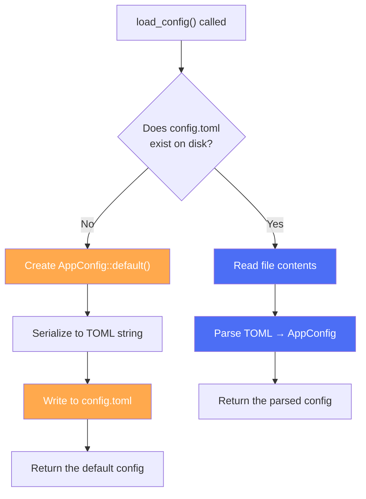

# Reading Guide: `config.rs`

> **Path:** `MVP/src/config.rs` · **Lines:** 38 · **Role:** Loads and manages application settings.

This is a small, self-contained module. Its only job is to read a `config.toml` file from disk, parse it into a Rust struct, and hand it back to `main.rs`. If no config file exists, it creates one with sensible defaults.

---

## Full Code Walkthrough

### Imports (Lines 1–3)

```rust
use serde::{Deserialize, Serialize};
use std::fs;
use anyhow::Result;
```

| Import | Why |
|:---|:---|
| `serde::{Deserialize, Serialize}` | Allows Rust structs to be automatically converted to/from text formats (TOML, JSON, etc.) |
| `std::fs` | File system operations (read, write) |
| `anyhow::Result` | Flexible error type — any error can be returned with a `?` |

---

### The `AppConfig` Struct (Lines 5–11)

```rust
#[derive(Debug, Serialize, Deserialize)]
pub struct AppConfig {
    pub hotkey: String,
    pub record_duration_ms: u64,
    pub audio_device_index: Option<usize>,
    pub openai_api_key: Option<String>,
}
```

This struct is the **single source of truth** for all configurable settings. Every field maps directly to a line in `config.toml`.

| Field | Type | Example Value | What it controls |
|:---|:---|:---|:---|
| `hotkey` | `String` | `"Ctrl+Shift+V"` | The keyboard shortcut that triggers recording |
| `record_duration_ms` | `u64` | `5000` | How many milliseconds to record audio |
| `audio_device_index` | `Option<usize>` | `None` | Which mic to use (None = system default) |
| `openai_api_key` | `Option<String>` | `Some("sk-proj-...")` | API key for OpenAI (only needed in Cloud mode) |

**What's `Option<T>`?** It means "this value might be present (`Some(value)`) or absent (`None`)." In TOML, you simply omit the line to get `None`.

**What's `#[derive(...)]`?** It tells the Rust compiler to auto-generate code. Here it generates:
- `Debug`: Allows printing the struct with `{:?}` (useful for logging)
- `Serialize`: Converts the struct → TOML string (for writing `config.toml`)
- `Deserialize`: Converts TOML string → struct (for reading `config.toml`)

---

### The Default Implementation (Lines 13–22)

```rust
impl Default for AppConfig {
    fn default() -> Self {
        Self {
            hotkey: "Ctrl+Shift+V".to_string(),
            record_duration_ms: 5000,
            audio_device_index: None,
            openai_api_key: None,
        }
    }
}
```

This defines what happens when you call `AppConfig::default()`. It provides safe, working values so the app can run even if `config.toml` is missing or corrupted. The `main()` function uses this via `unwrap_or_default()`:

```rust
// If load_config() fails → don't crash, use defaults
let config = config::load_config().unwrap_or_default();
```

---

### The `load_config()` Function (Lines 24–37)

```rust
pub fn load_config() -> Result<AppConfig> {
    let path = "config.toml";
    if !std::path::Path::new(path).exists() {
        let config = AppConfig::default();
        let toml = toml::to_string_pretty(&config)?;
        fs::write(path, toml)?;
        println!("Created default config: {}", path);
        return Ok(config);
    }
    
    let content = fs::read_to_string(path)?;
    let config: AppConfig = toml::from_str(&content)?;
    Ok(config)
}
```

**This function has two paths:**



**Path 1 — File doesn't exist (first run):**
1. Create an `AppConfig` with defaults.
2. Convert it to a pretty-printed TOML string using `toml::to_string_pretty()`.
3. Write that string to `config.toml` so the user can edit it later.
4. Return the default config.

**Path 2 — File exists:**
1. Read the entire file into a `String`.
2. Parse the string into an `AppConfig` using `toml::from_str()`.
3. Return the parsed config.

The `?` operator after each operation means: "If this fails, immediately return the error." This is Rust's way of doing error propagation without try/catch.

---

## Corresponding `config.toml` File

When the app first runs, it generates this file:

```toml
hotkey = "Ctrl+Shift+V"
record_duration_ms = 5000
```

The user can then edit this file to change settings. The cloud edition uses a separate `config-openai.toml` that also includes the `openai_api_key` field.

---

## Key Takeaways

1. **38 lines, one job** — this module is a clean example of single-responsibility design.
2. **Self-healing**: If the config file is missing, the app creates one automatically instead of crashing.
3. **`serde` + `toml`**: These two crates handle all the parsing. You define the struct, derive `Serialize`/`Deserialize`, and the conversion happens automatically.
4. **`Option` fields**: Using `Option<T>` for optional settings means the TOML file can simply omit those keys.
