# Reading Guide: `main.rs`

> **Path:** `MVP/src/main.rs` · **Lines:** 315 · **Role:** The central orchestrator of FluidVoice.

This is the largest and most important file in the project. It is the **entry point** of the application and contains the main loop, the hotkey listener, the audio pipeline, the OpenAI API integration, and the text-typing logic. Think of it as the conductor of an orchestra — it doesn't play every instrument, but it tells every other module when to play and what to do.

---

## Table of Contents

1. [Top-Level Structure](#1-top-level-structure)
2. [Imports & Feature Flags](#2-imports--feature-flags)
3. [The `main()` Function](#3-the-main-function)
4. [The `Modifiers` Struct](#4-the-modifiers-struct)
5. [The `run_pipeline()` Functions](#5-the-run_pipeline-functions)
6. [The `transcribe_openai()` Function](#6-the-transcribe_openai-function)
7. [The `type_text()` Function](#7-the-type_text-function)
8. [The `record_audio()` Function](#8-the-record_audio-function)
9. [Audio Processing Helpers](#9-audio-processing-helpers)

---

## 1. Top-Level Structure

The file is organized into these logical blocks:

```mermaid
graph TD
    subgraph "Lines 1–25: Setup"
        A["Module declarations (mod config, mod tray, etc.)"]
        B["Imports (cpal, rdev, enigo, etc.)"]
        C["Constants (WHISPER_SAMPLE_RATE = 16000)"]
    end

    subgraph "Lines 27–122: Core"
        D["main() — Entry point, setup, main loop"]
    end

    subgraph "Lines 124–140: Helper Struct"
        E["Modifiers — Tracks Ctrl/Shift state"]
    end

    subgraph "Lines 142–221: Pipeline Logic"
        F["run_pipeline() — Local version"]
        G["run_pipeline() — OpenAI version"]
        H["transcribe_openai() — API call"]
    end

    subgraph "Lines 223–314: Utility Functions"
        I["type_text() — Keyboard simulation"]
        J["record_audio() — Microphone capture"]
        K["to_mono() — Stereo → Mono"]
        L["resample() — Sample rate conversion"]
        M["save_to_wav() — Write WAV file"]
    end

    A --> D
    D --> F
    D --> G
    F --> J
    G --> J
    G --> H
    F --> I
    G --> I
    J --> K
    K --> L
    L --> M
```



---

## 2. Imports & Feature Flags

```
📍 Lines 1–24
```

### Line 1: The Windows Subsystem Attribute
```rust
#![cfg_attr(not(debug_assertions), windows_subsystem = "windows")]
```
This is a compiler instruction, not regular code. It says: **"In release builds, don't show a console window."** This is why you see a console when running with `cargo run` (debug mode) but not when double-clicking the `.exe` (release mode).

### Lines 3–10: Module Declarations
```rust
mod config;
mod telemetry;
mod tray;
mod audio_feedback;
#[cfg(feature = "local")]
mod model;
#[cfg(feature = "local")]
mod transcriber;
```

The `mod` keyword tells Rust: "There's another file with this name, include it as part of this program." The `#[cfg(feature = "local")]` annotations mean that `model.rs` and `transcriber.rs` are **only compiled** when building the Local edition. They don't exist in the OpenAI build at all — not even as dead code.

### Lines 12–23: External Imports

| Import | Library | Purpose |
|:---|:---|:---|
| `anyhow::Result` | `anyhow` | Flexible error handling (any error type, with context messages) |
| `colored::*` | `colored` | Adds color to terminal output (`.red()`, `.green()`, etc.) |
| `cpal::*` | `cpal` | Cross-platform audio capture (talks to your microphone) |
| `hound::*` | `hound` | Reads/writes WAV audio files |
| `rdev::*` | `rdev` | Global keyboard event listener |
| `single_instance` | `single-instance` | Prevents multiple copies of the app running |
| `std::sync::mpsc` | Standard Library | Multi-producer, single-consumer channel (thread communication) |
| `std::thread` | Standard Library | Spawning OS threads |

### Line 25: The Only Constant
```rust
const WHISPER_SAMPLE_RATE: u32 = 16000;
```
The Whisper AI model expects audio at exactly 16,000 samples per second. This constant is used throughout the audio processing pipeline.

---

## 3. The `main()` Function

```
📍 Lines 27–122
```

This is where the program starts. It's a long function, but it follows a clear linear structure:

### Phase 1: Setup (Lines 28–53)

| Step | What it does | Calls |
|:---|:---|:---|
| Single instance check | Prevents duplicate processes | `SingleInstance::new()` |
| Load config | Reads `config.toml` | `config::load_config()` |
| Load telemetry | Reads `stats.json` | `telemetry::load_stats()` |
| Init AI (Local only) | Downloads model + loads into RAM | `model::ensure_model_exists()`, `LocalTranscriber::new()` |
| Init tray | Creates system tray icon | `tray::SystemTray::new()` |
| Init audio | Opens speaker for beeps | `AudioFeedback::new()` |

### Phase 2: Hotkey Listener (Lines 56–76)

A new thread is spawned that runs forever. It uses `rdev::listen()` to receive every keyboard event from the OS. The callback function:
1. Updates the `Modifiers` struct (tracking Ctrl/Shift state).
2. If `V` is pressed while `Ctrl + Shift` are held → sends `()` through the channel.

**Key concept: `mpsc::channel`**

```rust
let (tx, rx) = mpsc::channel::<()>();
```

- `tx` ("transmitter") → goes to the listener thread
- `rx` ("receiver") → stays in the main thread
- The `()` type means we're sending an empty signal — just a "go!" notification, no data

### Phase 3: Main Loop (Lines 87–119)

```rust
loop {
    match rx.recv() {
        Ok(_) => { /* pipeline */ }
        Err(_) => break,
    }
}
```

`rx.recv()` **blocks** — the main thread literally sleeps here, consuming zero CPU. When the listener thread sends a signal, the main thread wakes up, runs the pipeline, and then goes back to sleep.

Inside the `Ok` branch:
1. Play start beep
2. Call `run_pipeline()` (which records, processes, transcribes, and types)
3. On success → play stop beep
4. On failure → play error beep + record error
5. Save stats
6. Loop back to `rx.recv()`

---

## 4. The `Modifiers` Struct

```
📍 Lines 124–140
```

This is a simple helper that tracks whether `Ctrl` and `Shift` are currently being held down.

```rust
struct Modifiers {
    ctrl: bool,
    shift: bool,
}
```

The `update()` method is called on every keyboard event. It sets the booleans to `true` on `KeyPress` and `false` on `KeyRelease`. It handles both left and right variants of each modifier key.

**Why is this needed?** The `rdev` library gives us individual key events, not combinations. We have to manually reconstruct "is the user holding Ctrl+Shift+V?" by tracking modifier state ourselves.

---

## 5. The `run_pipeline()` Functions

```
📍 Lines 142–196
```

There are **two versions** of this function, selected at compile time:

### Local Version (Lines 144–167)
```rust
fn run_pipeline(duration_ms: u64, transcriber: Arc<LocalTranscriber>) -> Result<()>
```

Flow:
1. `record_audio()` → get raw samples
2. `to_mono()` → stereo to mono
3. `resample()` → device sample rate to 16 kHz
4. `save_to_wav()` → debug save
5. `transcriber.transcribe()` → AI inference on raw samples
6. `type_text()` → simulate keyboard

### OpenAI Version (Lines 170–196)
```rust
fn run_pipeline(duration_ms: u64, api_key: Option<String>) -> Result<()>
```

Flow:
1. `record_audio()` → get raw samples
2. `to_mono()` → stereo to mono
3. `resample()` → device sample rate to 16 kHz
4. `save_to_wav()` → **required** (the WAV file is sent to OpenAI)
5. `transcribe_openai()` → HTTP API call
6. `type_text()` → simulate keyboard


---

## 6. The `transcribe_openai()` Function

```
📍 Lines 198–221 · Only compiled in OpenAI mode
```

This function sends a WAV file to OpenAI and gets text back.

**Step-by-step:**
1. Create an HTTP client with `reqwest`.
2. Build a `multipart::Form` with the WAV file and `model: "whisper-1"`.
3. Send a `POST` to `https://api.openai.com/v1/audio/transcriptions`.
4. Check if the response status is success (2xx).
5. Parse the JSON response and extract the `"text"` field.

**Error handling:** If the API returns an error (wrong key, rate limit, etc.), the function reads the error body and returns it wrapped in `anyhow!()`.

---

## 7. The `type_text()` Function

```
📍 Lines 223–235
```

The final step in the pipeline. It takes a `&str` and simulates typing it.

**How it works:**
- Creates an `Enigo` instance (connects to OS input simulation).
- Loops through each character:
  - `\n` → presses Enter
  - `\t` → presses Tab
  - Everything else → types the character normally via `key_sequence()`
- 10ms delay between characters to avoid overwhelming the target application.

**Why `key_sequence()` instead of `key_click()`?** `key_click()` works for single keys like Enter or Tab. `key_sequence()` handles arbitrary Unicode characters — letters, numbers, punctuation, and even accented characters or emoji.

---

## 8. The `record_audio()` Function

```
📍 Lines 237–281
```

This is the most complex utility function. It interfaces with the OS audio system.

**Step-by-step:**
1. Get the default audio host and input device.
2. Read the device's native config (sample rate, channels, sample format).
3. Create a shared buffer: `Arc<Mutex<Vec<f32>>>` — thread-safe, growable array.
4. Build an input stream with a callback that appends new samples to the buffer.
5. Start the stream with `.play()`.
6. Sleep for the configured duration.
7. Stop the stream by dropping it.
8. Extract the samples from the `Arc<Mutex<...>>`.

**Sample format handling (Lines 248–271):**

Microphones can output data in different formats. The function handles three:

| Format | Range | Conversion to f32 |
|:---|:---|:---|
| `F32` | -1.0 to 1.0 | No conversion needed |
| `I16` | -32768 to 32767 | Divide by `i16::MAX` (32767) |
| `U16` | 0 to 65535 | Divide by `u16::MAX`, scale to -1.0..1.0 |

---

## 9. Audio Processing Helpers

### `to_mono()` (Lines 283–286)
Averages multi-channel samples into a single channel. If already mono, returns a copy.

### `resample()` (Lines 288–302)
Converts from one sample rate to another using linear interpolation. Calculates where each output sample falls in the input and blends the two nearest neighbors.

### `save_to_wav()` (Lines 304–314)
Writes the `f32` samples to a standard WAV file. Clamps values to [-1.0, 1.0] and converts to 16-bit integers (the WAV format standard).

---

## Key Takeaways

1. **`main.rs` is a pipeline orchestrator** — it coordinates all other modules.
2. **Feature flags (`#[cfg]`)** split the code into two compilable variants without any runtime cost.
3. **Threading model**: Two threads — one for listening, one for doing work — connected by a channel.
4. **Audio pipeline**: Raw capture → Mono conversion → Resampling → AI → Text injection.
5. **Error handling**: Uses `anyhow` throughout, with `?` for propagation and `.context()` for adding useful messages.
