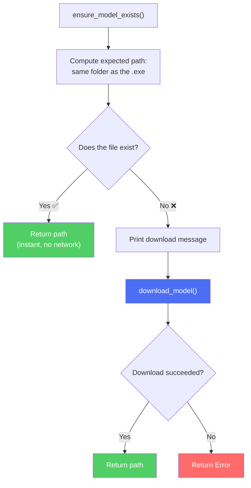

# Reading Guide: `model.rs`

> **Path:** `MVP/src/model.rs` · **Lines:** 55 · **Role:** Ensures the Whisper AI model file exists on disk.
>
> ⚠️ **Only compiled in Local mode** (`#[cfg(feature = "local")]`)

This module answers one question: *"Is the AI brain file present on disk?"* If yes, it gives main.rs the path. If no, it downloads it from the internet first. This only happens once — after the first download, the file stays on disk forever.

---

## Full Code Walkthrough

### Constants (Lines 7–8)

```rust
const MODEL_URL: &str = "https://huggingface.co/ggerganov/whisper.cpp/resolve/main/ggml-base.en.bin";
const MODEL_FILENAME: &str = "ggml-base.en.bin";
```

| Constant | Value | What it is |
|:---|:---|:---|
| `MODEL_URL` | HuggingFace URL | Where to download the model from |
| `MODEL_FILENAME` | `ggml-base.en.bin` | The file name to look for and save as |

The model is the **ggml-base.en** variant — a quantized (compressed) version of OpenAI's Whisper "base" model, English-only. It's about 142 MB.

---

### `ensure_model_exists()` (Lines 10–33)

```rust
pub fn ensure_model_exists() -> Result<PathBuf> {
    let mut path = std::env::current_exe()?;
    path.pop();  // Remove executable name
    path.push(MODEL_FILENAME);

    if path.exists() {
        println!("✓ Model found at: {:?}", path);
        return Ok(path);
    }

    println!("⬇ Model not found. Downloading...");
    download_model(&path)?;
    println!("✓ Model downloaded successfully!");
    Ok(path)
}
```

**Step-by-step:**

1. **Find the exe's folder**: `current_exe()` returns something like `C:\FluidVoice\fluidvoice-mvp.exe`. Calling `path.pop()` removes the filename, leaving `C:\FluidVoice\`. Then `path.push(MODEL_FILENAME)` gives us `C:\FluidVoice\ggml-base.en.bin`.
2. **Check if it exists**: If the file is already there → return the path immediately.
3. **Download if missing**: Call `download_model()` to fetch it from the internet.



---

### `download_model()` (Lines 35–54)

```rust
fn download_model(path: &Path) -> Result<()> {
    let client = reqwest::blocking::Client::builder()
        .timeout(std::time::Duration::from_secs(600))
        .build()?;

    let response = client.get(MODEL_URL)
        .send()
        .context("Failed to connect to model URL")?;

    if !response.status().is_success() {
        anyhow::bail!("Failed to download model: Status {}", response.status());
    }

    let content = response.bytes()?;
    let mut file = fs::File::create(path)?;
    file.write_all(&content)?;

    Ok(())
}
```

**Step-by-step:**

1. **Create an HTTP client** with a 10-minute timeout (the download is ~142 MB, so it can take a while on slow connections).
2. **Send a GET request** to the HuggingFace URL.
3. **Check the response status** — if it's not 2xx (success), bail with an error.
4. **Read the entire response body** into memory as bytes.
5. **Write the bytes to disk** at the computed path.

> [!NOTE]
> This downloads the **entire file into RAM** before writing (`.bytes()` reads everything at once). For a 142 MB file this is fine on modern computers, but a streaming approach would be better for very large models.

---

## Key Takeaways

1. **One-time download**: The model is fetched once and cached forever next to the `.exe`.
2. **Placement strategy**: The model lives in the same directory as the executable — simple and portable.
3. **Blocking HTTP**: Uses `reqwest::blocking` (synchronous HTTP) because this runs during startup, before the main loop begins. There's nothing else to do while waiting.
4. **This file doesn't exist in the OpenAI build** — the `#[cfg(feature = "local")]` attribute in `main.rs` ensures it's never compiled for cloud mode.
