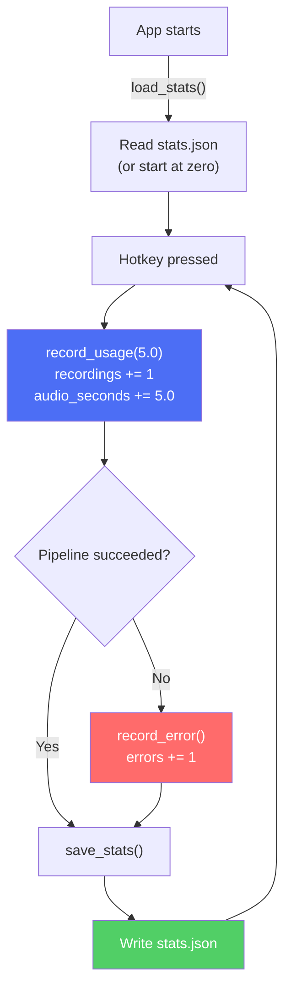

# Reading Guide: `telemetry.rs`

> **Path:** `MVP/src/telemetry.rs` · **Lines:** 55 · **Role:** Tracks and persists usage statistics.

This module keeps a running count of how many times you've used FluidVoice, how much audio you've recorded, and how many errors have occurred. It saves this data to `stats.json` so it survives app restarts.

---

## Why Does This Exist?

Even in an MVP, knowing how the app is being used is valuable:
- *"Have I actually used this 50 times or just 5?"*
- *"Is the error rate high? Maybe I need to fix something."*
- *"How many minutes of audio have I recorded in total?"*

This isn't analytics sent to a server — it's a local-only JSON file sitting next to the `.exe`.

---

## Full Code Walkthrough

### The `UsageStats` Struct (Lines 6–12)

```rust
#[derive(Debug, Serialize, Deserialize, Default)]
pub struct UsageStats {
    pub total_recordings: usize,
    pub total_audio_seconds: f64,
    pub errors_encountered: usize,
    pub last_used: Option<SystemTime>,
}
```

| Field | Type | What it tracks |
|:---|:---|:---|
| `total_recordings` | `usize` | How many times you've pressed the hotkey |
| `total_audio_seconds` | `f64` | Total seconds of audio recorded across all sessions |
| `errors_encountered` | `usize` | How many pipeline failures have occurred |
| `last_used` | `Option<SystemTime>` | Timestamp of the most recent recording |

The `#[derive(Default)]` provides automatic zeroed-out initial values (0, 0.0, 0, None).

---

### The Global `STATS` Variable (Lines 14–19)

```rust
pub static STATS: Mutex<UsageStats> = Mutex::new(UsageStats {
    total_recordings: 0,
    total_audio_seconds: 0.0,
    errors_encountered: 0,
    last_used: None,
});
```

This is a **global mutable variable**, protected by a `Mutex`. In Rust, you can't just have a global `mut` variable — that would be unsafe in a multi-threaded program. The `Mutex` ensures only one thread can read or write the stats at a time.

**Why global instead of passed around?** Simplicity. The stats need to be updated from multiple places in `main.rs` (`record_usage()`, `record_error()`, `save_stats()`). Passing a reference everywhere would add noise to function signatures for a simple counter.

---

### `load_stats()` — Reading Saved Data (Lines 21–27)

```rust
pub fn load_stats() {
    if let Ok(content) = fs::read_to_string("stats.json") {
        if let Ok(loaded) = serde_json::from_str::<UsageStats>(&content) {
            *STATS.lock().unwrap() = loaded;
        }
    }
}
```

Called once at startup. It tries to:
1. Read `stats.json` from disk.
2. Parse its JSON content into a `UsageStats`.
3. Replace the global `STATS` with the loaded data.

**Notice the double `if let`**: If the file doesn't exist, or is corrupted, or can't be parsed — the function silently does nothing. The global stats stay at zero. No crash, no error. This is intentional: stats are nice-to-have, never critical.

---

### `save_stats()` — Writing to Disk (Lines 29–34)

```rust
pub fn save_stats() {
    let stats = STATS.lock().unwrap();
    if let Ok(json) = serde_json::to_string_pretty(&*stats) {
        let _ = fs::write("stats.json", json);
    }
}
```

Called after every pipeline run (success or failure). It:
1. Locks the mutex to get a read on the current stats.
2. Serializes the struct to pretty-printed JSON.
3. Writes it to `stats.json`.

The `let _ =` before `fs::write` discards any error (e.g., disk full, permissions). Again — stats are not critical.

---

### `record_usage()` and `record_error()` (Lines 36–46)

```rust
pub fn record_usage(duration_secs: f64) {
    let mut stats = STATS.lock().unwrap();
    stats.total_recordings += 1;
    stats.total_audio_seconds += duration_secs;
    stats.last_used = Some(SystemTime::now());
}

pub fn record_error() {
    let mut stats = STATS.lock().unwrap();
    stats.errors_encountered += 1;
}
```

These are called from `main.rs` during the pipeline:
- `record_usage(5.0)` is called right after recording finishes (even before transcription).
- `record_error()` is called only if the pipeline fails.

Both lock the mutex, modify the struct, and unlock automatically when the function returns.

---

### `print_summary()` (Lines 48–54)

```rust
pub fn print_summary() {
    let stats = STATS.lock().unwrap();
    println!("\n📊 Session Summary:");
    println!("  Recordings: {}", stats.total_recordings);
    println!("  Total Audio: {:.1}s", stats.total_audio_seconds);
    println!("  Errors: {}", stats.errors_encountered);
}
```

A debug helper that prints the current stats to the console. Not currently called in the main flow, but useful for development.

---

### Example `stats.json`

After a few uses, the file might look like:

```json
{
  "total_recordings": 12,
  "total_audio_seconds": 60.0,
  "errors_encountered": 1,
  "last_used": {
    "secs_since_epoch": 1739856000,
    "nanos_since_epoch": 0
  }
}
```

---

## Data Flow in the Pipeline



---

## Key Takeaways

1. **Local-only telemetry**: No data is sent anywhere. It's a simple JSON file.
2. **Fail-safe design**: Every I/O operation silently handles errors. The app never crashes because of stats.
3. **Global Mutex pattern**: Simple but effective for a single-purpose counter accessed from one thread.
4. **Cumulative across sessions**: Because stats are loaded at startup and saved after each use, the numbers accumulate over the lifetime of the installation.
