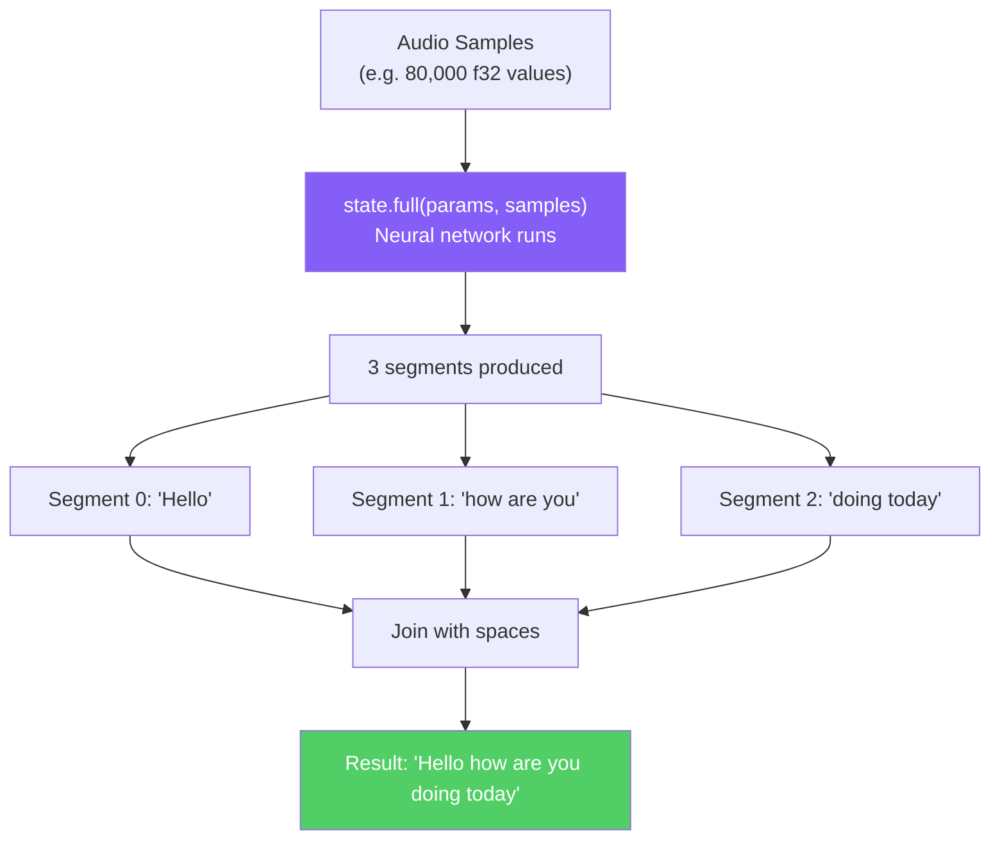

# Reading Guide: `transcriber.rs`

> **Path:** `MVP/src/transcriber.rs` · **Lines:** 55 · **Role:** Runs the Whisper AI model to convert audio → text.
>
> ⚠️ **Only compiled in Local mode** (`#[cfg(feature = "local")]`)

This module is the "brain" of the local edition. It loads the Whisper neural network model into memory and provides a single method — `transcribe()` — that takes audio samples and returns a text string.

---

## Full Code Walkthrough

### The `LocalTranscriber` Struct (Lines 6–8)

```rust
pub struct LocalTranscriber {
    ctx: WhisperContext,
}
```

The struct has one field: `ctx`, a `WhisperContext`. This is the loaded AI model — all the neural network weights, parameters, and internal state, sitting in RAM (several hundred MB). It's created once during startup and reused for every recording.

**Why wrap it in a struct?** Encapsulation. Instead of passing a raw `WhisperContext` around, we wrap it in `LocalTranscriber` and expose only the methods we need (`new()` and `transcribe()`).

---

### `new()` — Loading the Model (Lines 10–21)

```rust
pub fn new(model_path: &Path) -> Result<Self> {
    println!("⏳ Loading Whisper model...");
    
    let ctx = WhisperContext::new_with_params(
        model_path.to_str().unwrap(), 
        WhisperContextParameters::default()
    ).context("Failed to load Whisper model")?;

    println!("✓ Model loaded!");
    Ok(Self { ctx })
}
```

This function:
1. Takes the path to the model file (e.g., `C:\FluidVoice\ggml-base.en.bin`).
2. Calls `WhisperContext::new_with_params()` which **reads the entire file and loads the neural network into RAM**.
3. Returns a `LocalTranscriber` wrapping the loaded context.

This is the **most expensive startup operation** — it can take a few seconds and uses several hundred MB of RAM. That's why it's done once at boot, not on every recording.

---

### `transcribe()` — Running Inference (Lines 23–53)

```rust
pub fn transcribe(&self, audio_samples: &[f32]) -> Result<String>
```

This is the core AI function. It takes a slice of audio samples (mono, 16 kHz, f32 values between -1.0 and 1.0) and returns the transcribed text.

**Step-by-step:**

#### Step 1: Create a state (Line 25)
```rust
let mut state = self.ctx.create_state()?;
```
A "state" is a temporary workspace for one inference run. The model (`ctx`) is shared, but each transcription gets its own state so they don't interfere with each other.

#### Step 2: Configure parameters (Lines 28–34)
```rust
let mut params = FullParams::new(SamplingStrategy::Greedy { best_of: 1 });
params.set_n_threads(4);
params.set_language(Some("en"));
params.set_print_special(false);
params.set_print_progress(false);
params.set_print_realtime(false);
params.set_print_timestamps(false);
```

| Parameter | Value | What it means |
|:---|:---|:---|
| `SamplingStrategy::Greedy` | `best_of: 1` | At each step, pick the #1 most likely word. No randomness. |
| `n_threads` | `4` | Use 4 CPU threads for parallel computation |
| `language` | `"en"` | Only look for English words (faster than auto-detect) |
| `print_*` | `false` | Don't spam the console with internal debug info |

#### Step 3: Run the AI (Line 37)
```rust
state.full(params, audio_samples)?;
```
This single line does all the heavy lifting. The neural network processes the audio through its layers and produces text segments. On a modern CPU, this takes 1–3 seconds for 5 seconds of audio.

#### Step 4: Collect results (Lines 40–50)
```rust
let num_segments = state.full_n_segments();
let mut text = String::new();

for i in 0..num_segments {
    let segment = state.get_segment(i).expect("Segment index out of bounds");
    let segment_text = segment.to_str()?;
    text.push_str(segment_text);
    text.push(' ');
}

Ok(text.trim().to_string())
```

Whisper divides the audio into segments (roughly corresponding to sentences or phrases). We loop through all segments, extract the text from each, and join them with spaces.



---

## How This Connects to `main.rs`

In `main.rs`, the transcriber is created once and wrapped in `Arc`:

```rust
let transcriber = Arc::new(transcriber::LocalTranscriber::new(&model_path)?);
```

`Arc` (Atomic Reference Counter) lets the transcriber be safely shared. When the hotkey is pressed, a clone of the `Arc` is passed to `run_pipeline()`:

```rust
let t_clone = transcriber.clone();  // Cheap! Just increments a counter.
let result = run_pipeline(config_duration, t_clone);
```

Inside `run_pipeline()`, it calls:

```rust
let transcript = transcriber.transcribe(&resampled)?;
```

---

## Key Takeaways

1. **Expensive to load, cheap to use**: Creating the `LocalTranscriber` is slow (loads ~142 MB model). Calling `transcribe()` is fast (1–3 seconds per 5 seconds of audio).
2. **Greedy decoding**: The model always picks the most likely word — fast and deterministic, but may miss context sometimes.
3. **Language is hardcoded to English**: This avoids the auto-detection overhead.
4. **Thread-safe via `Arc`**: The model is loaded once and shared safely.
