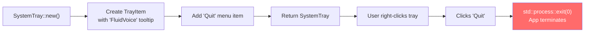

# Reading Guide: `tray.rs`

> **Path:** `MVP/src/tray.rs` · **Lines:** 28 · **Role:** Creates a Windows system tray icon.

This is the simplest module in the project. It puts a small icon in the Windows taskbar tray (bottom-right corner, near the clock) and adds a "Quit" menu item. That's it.

---

## Why Does This Exist?

In release mode, FluidVoice runs with **no console window** (because of the `windows_subsystem = "windows"` attribute in `main.rs`). Without a visible window, the user has no way to:
1. Know the app is running.
2. Close the app.

The system tray icon solves both problems — it shows the app's presence and provides a right-click menu to quit.

---

## Full Code Walkthrough

### The `SystemTray` Struct (Lines 4–6)

```rust
pub struct SystemTray {
    pub tray: TrayItem,
}
```

A thin wrapper around `TrayItem` from the `tray-item` crate. The wrapper exists so `main.rs` can hold onto it as a named variable (`_tray_system`) without needing to know the internal library types.

---

### `new()` — Creating the Tray Icon (Lines 8–27)

```rust
pub fn new() -> anyhow::Result<Self> {
    let mut tray = TrayItem::new("FluidVoice", IconSource::Resource("main-icon"))
        .map_err(|e| anyhow::anyhow!("Failed to create tray: {}", e))?;

    tray.add_menu_item("Quit", || {
        std::process::exit(0);
    }).map_err(|e| anyhow::anyhow!("Failed to add menu item: {}", e))?;

    Ok(Self { tray })
}
```

**Step-by-step:**

1. **Create the tray item**: `TrayItem::new()` takes two arguments:
   - `"FluidVoice"` — the tooltip text shown when hovering over the icon
   - `IconSource::Resource("main-icon")` — loads the icon from an embedded Windows resource in the `.exe`
2. **Add the Quit menu item**: When the user right-clicks the tray icon and selects "Quit", the closure `|| { std::process::exit(0); }` runs, which immediately terminates the entire process with exit code 0 (success).



---

### How `main.rs` Uses This

```rust
let _tray_system = tray::SystemTray::new().ok();
```

The `.ok()` at the end converts `Result` to `Option`, discarding any error. This means: **"If the tray icon fails to create, just continue without one."** The app still works — the user just won't see a tray icon (they can still close the app with the Task Manager).

The variable is named `_tray_system` (with underscore prefix) because the code never calls any methods on it after creation. The underscore tells the Rust compiler "I know I'm not using this directly, stop warning me." However, the variable must **stay alive** — if it's dropped, the tray icon disappears.

---

## Key Takeaways

1. **28 lines, minimal scope** — this module does exactly one thing.
2. **Graceful degradation**: If tray creation fails, the app continues without it.
3. **The icon**: Uses `IconSource::Resource`, which expects a `.ico` embedded in the `.exe` via a build script. If the resource isn't found, the tray might show a blank icon or fail to create.
4. **Hard exit**: The Quit handler uses `std::process::exit(0)` — a hard termination. This skips Rust's normal cleanup (drop handlers). For an MVP this is fine, but a production app would use a graceful shutdown signal.
